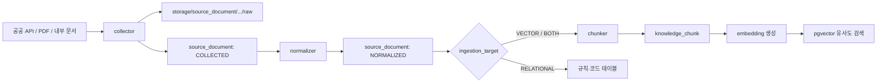

# VDB 데이터 흐름

## 1. 세 객체의 역할

| 객체 | 질문 | 저장하는 것 |
|---|---|---|
| `source_registry` | 이 자료를 사용해도 되는가? | 기관, URL, 라이선스, 사용 목적, 갱신 주기 |
| `source_document` | 어떤 원문을 언제 수집했는가? | 원본 경로, 원문, 정규화 본문, 버전, 체크섬, 처리 상태 |
| `knowledge_chunk` | 어떤 문단을 의미 검색할 것인가? | 문서 조각, 섹션, 메타데이터, 임베딩 |



## 2. 처리 순서

1. `source_registry`에 출처와 이용 조건을 등록합니다.
2. 수집기는 원본을 `storage/source_document/<source_code>/raw`에 보관합니다.
3. 파일 경로와 원문 메타데이터를 `source_document`에 `COLLECTED` 상태로 저장합니다.
4. HTML 태그 제거, 문자 정리, 공통 필드 매핑 후 `normalized_content`를 채웁니다.
5. `ingestion_target`이 `VECTOR` 또는 `BOTH`인 문서만 문단 단위로 자릅니다.
6. 자른 문단을 `knowledge_chunk`에 넣고 임베딩 생성 후 `CHUNKED`로 바꿉니다.
7. 답변에는 검색된 청크와 함께 원본 `source_url`, 문서 버전, 수집일을 표시합니다.

검진항목이 `screening_item`으로 매핑된 뒤에는 벡터검색보다 `knowledge_key` 직접 조회를
우선합니다. 벡터검색은 사용자의 자유 질문과 동의어가 많은 질문에만 사용합니다.

## 3. 문서 예시

e약은요 API에서 의약품 한 건을 수집했다면 `source_document` 한 건을 만들고 다음과 같이
여러 `knowledge_chunk`로 분리합니다.

```text
source_document
└── 타이레놀정 500mg / API 응답 버전 2026-07-16
    ├── DRUG_EFFICACY       효능
    ├── DRUG_USAGE          사용 방법
    ├── DRUG_WARNING        중요한 경고
    ├── DRUG_CAUTION        주의사항
    ├── DRUG_INTERACTION    상호작용
    ├── DRUG_SIDE_EFFECT    부작용
    └── DRUG_STORAGE        보관 방법
```

검진 판정기준 PDF도 `source_document`에는 기록할 수 있지만,
`ingestion_target=RELATIONAL`로 지정해 수치 판정용 VDB 청크는 만들지 않습니다.

## 4. 검색 SQL 예시

```sql
SELECT
    kc.content,
    kc.section_type,
    sd.title,
    sd.source_url,
    sr.provider_name,
    1 - (kc.embedding <=> :query_embedding) AS similarity
FROM knowledge_chunk kc
JOIN source_document sd ON sd.id = kc.source_document_id
JOIN source_registry sr ON sr.id = sd.source_id
WHERE kc.embedding IS NOT NULL
  AND sr.is_active = TRUE
  AND sr.license_status = 'APPROVED'
ORDER BY kc.embedding <=> :query_embedding
LIMIT 5;
```

운영 코드에서는 `:query_embedding`을 임베딩 API 결과로 바인딩하고,
낮은 유사도 결과를 답변 근거로 사용하지 않도록 별도 임계값을 둡니다.

## 5. 마이그레이션 적용 순서

```bash
psql "$DATABASE_URL" -f database/migrations/000_extensions.sql
psql "$DATABASE_URL" -f database/migrations/010_source_registry.sql
psql "$DATABASE_URL" -f database/migrations/020_source_document.sql
psql "$DATABASE_URL" -f database/migrations/030_knowledge_chunk.sql
psql "$DATABASE_URL" -f database/migrations/040_vdb_governance.sql
psql "$DATABASE_URL" -f database/migrations/050_screening_dictionary.sql
psql "$DATABASE_URL" -f database/migrations/060_vdb_retrieval.sql
psql "$DATABASE_URL" -f database/migrations/070_screening_output.sql
psql "$DATABASE_URL" -f database/seeds/010_sources.sql
psql "$DATABASE_URL" -f database/seeds/020_screening_dictionary.sql
psql "$DATABASE_URL" -f database/seeds/030_vdb_core.sql
```

임베딩 모델이 1536차원이 아니면 `030_knowledge_chunk.sql`의 `VECTOR(1536)`을
선택한 모델의 차원에 맞춘 뒤 처음 적용해야 합니다.

30개 코어 청크의 원본은 `vdb/corpus/screening_core_v1.json`이고 생성된 SQL은
`database/seeds/030_vdb_core.sql`입니다. 두 파일은 다음 명령으로 동기화를 검사합니다.

```bash
python3 scripts/build_vdb_seed.py --check
```
