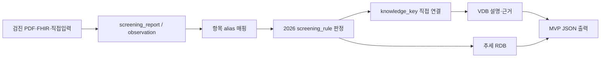

# 건강관리앱 MVP VDB 완성 사양

## 1. 결론

이 VDB는 `국가건강검진 핵심 30개 설명 청크`와 `복약정보 동적 청크`를 담당합니다.
사용자 검사수치, 판정기준, 항목명 매핑과 시계열은 RDB에 두고 개인 건강데이터는 임베딩하지 않습니다.



## 2. RDB와 VDB의 경계

| 데이터 | 저장 위치 | 이유 |
|---|---|---|
| 사용자 검사 원값·단위·검사일 | `screening_observation` | 정확 조회와 개인정보 분리 |
| OCR/PDF 추출 신뢰도·확인상태 | `screening_report`, `screening_observation` | 오인식값 차단 |
| 항목명·동의어 매핑 | `screening_item`, `screening_item_alias` | 결정적 매핑이 벡터검색보다 정확함 |
| 정상A/B·질환의심 수치 | `screening_rule` | 버전·성별·경계값을 정확히 계산 |
| 검사 의미·해석 한계·주의점 | `knowledge_chunk` | 자연어 질문의 근거 검색 |
| 개인별 질병 확률·치료 추천 | 현재 미구축 | 임상 규칙과 의료진 검수가 필요함 |

## 3. 지금 만들 수 있는 아웃풋

| 출력 | 가능 여부 | 구현 |
|---|---:|---|
| 검사명 표준화 | 가능 | alias → `item_code` |
| 2026 국가검진 판정 | 가능 | `classify_screening_value()` |
| 쉬운 항목 설명 | 가능 | `knowledge_key` → VDB 직접 조회 |
| 공식 근거 링크 | 가능 | chunk `metadata.evidence` |
| 입력 신뢰도·사용자 확인 필요 | 가능 | `requires_confirmation` |
| 최신 검진 한 줄 개인화 훅 | 가능 | 검증 완료 관측값에 한함 |
| 항목별 과거 추세 | 가능 | `get_screening_trend()` |
| 종합 원인 분석 | 조건부 | 임상검수 완료 청크만 허용하도록 게이트됨 |
| 재검 시기·치료·약 변경 | 불가 | 별도 임상규칙과 의료진 승인 필요 |
| 확정 진단 | 불가 | 앱 출력 범위 밖 |

## 4. MVP 출력 JSON

```sql
SELECT build_screening_report_output(:report_id);
```

```json
{
  "report": {
    "report_id": "...",
    "screened_on": "2026-07-01",
    "source_method": "PDF_TEXT",
    "verification_status": "USER_CONFIRMED"
  },
  "summary": {
    "overall_status": "NORMAL_B",
    "item_count": 16,
    "borderline_count": 2,
    "suspected_count": 0,
    "confirmation_count": 0
  },
  "items": [
    {
      "item_code": "FASTING_GLUCOSE",
      "display_name": "공복혈당",
      "value": 108,
      "unit": "mg/dL",
      "result_status": "NORMAL_B",
      "knowledge": {
        "canonical_key": "FASTING_GLUCOSE",
        "explanation": "공복혈당은 일정 시간 금식한 뒤...",
        "evidence": [{"label": "건강검진 검사항목별 판정기준", "url": "https://law.go.kr/..."}]
      },
      "quality": {
        "verification_status": "USER_CONFIRMED",
        "requires_confirmation": false
      }
    }
  ],
  "output_policy": {
    "simple_lookup": true,
    "personal_hook": true,
    "comprehensive_analysis": false,
    "proactive_care": false
  }
}
```

## 5. 검색 방법

검사 항목이 매핑된 경우 벡터검색을 하지 않고 키로 직접 조회합니다.

```sql
SELECT * FROM get_knowledge_by_key('FASTING_GLUCOSE', 'SIMPLE_LOOKUP');
```

사용자의 자유 질문은 하이브리드 검색을 사용합니다.

```sql
SELECT *
FROM search_knowledge(
    p_query => '공복혈당이 왜 오를 수 있어?',
    p_query_embedding => :embedding,
    p_route => 'SIMPLE_LOOKUP',
    p_domain => 'GLUCOSE_METABOLISM',
    p_limit => 5
);
```

`COMPREHENSIVE_ANALYSIS`와 `PROACTIVE_CARE`는 `CLINICALLY_APPROVED` 청크만 반환합니다.
현재 30개 코어 청크는 `SOURCE_VERIFIED`이므로 단순 설명에는 사용할 수 있지만 종합분석에는 검색되지 않습니다.

## 6. 적재 순서

```bash
psql "$DATABASE_URL" -f database/migrations/000_extensions.sql
psql "$DATABASE_URL" -f database/migrations/010_source_registry.sql
psql "$DATABASE_URL" -f database/migrations/020_source_document.sql
psql "$DATABASE_URL" -f database/migrations/030_knowledge_chunk.sql
psql "$DATABASE_URL" -f database/migrations/040_vdb_governance.sql
psql "$DATABASE_URL" -f database/migrations/050_screening_dictionary.sql
psql "$DATABASE_URL" -f database/migrations/060_vdb_retrieval.sql
psql "$DATABASE_URL" -f database/migrations/070_screening_output.sql
psql "$DATABASE_URL" -f database/seeds/010_sources.sql
psql "$DATABASE_URL" -f database/seeds/020_screening_dictionary.sql
psql "$DATABASE_URL" -f database/seeds/030_vdb_core.sql
```

청크를 수정한 뒤에는 생성 SQL을 다시 만들고 동기화를 검사합니다.

```bash
python3 scripts/build_vdb_seed.py
python3 scripts/build_vdb_seed.py --check
```

임베딩은 승인된 출처·청크만 선택하는 워커를 사용합니다.

```bash
python3 -m pip install -r requirements-vdb.txt
DATABASE_URL=... \
EMBEDDING_API_URL=... \
EMBEDDING_API_KEY=... \
EMBEDDING_MODEL=... \
EMBEDDING_DIMENSION=1536 \
python3 vdb/embeddings/embed_pending.py
```

## 7. 운영 승인 전 남은 일

1. 30개 자체 설명문을 가정의학과 또는 검진의학 의료진이 검수합니다.
2. 승인된 청크만 `CLINICALLY_APPROVED`로 승격합니다.
3. 검사기관별 PDF 템플릿에서 단위와 항목 매핑 테스트를 수행합니다.
4. 고위험 정신건강 질문의 별도 안전 라우팅을 연결합니다.
5. e약은요 API는 사용자 복약 목록에 있는 품목만 온디맨드 수집합니다.

